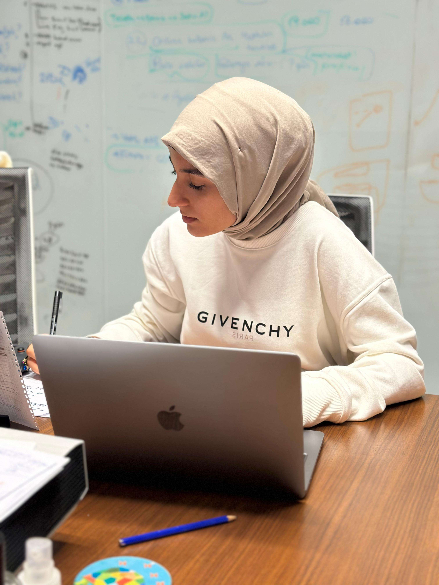

# BootCampUnity-47

<html>
  <body>
   
   ## Takım İsmi

> **Team U-47**

  # **Team & Product Name**

  ### **`Cartomazer`**

  # Ekip ve Ürün Hakkında Bilgiler

  ## Ekip Üyeleri

  <table>
    <tr>
      <th></th>
      <th>Name</th>
      <th>Title</th>
      <th>Socials</th>
    </tr>
    <tr>
      <td></td>
      <td>Sümeyye Ordueri</td>
      <td>Scrum Master</td>
      <td>
        
        
        
      </td>
    </tr>
    <tr>
      <td></td>
      <td>Semi Yaeş</td>
      <td>Product Owner</td>
      <td>
        
        
      </td>
    </tr>
    <tr>
      <td></td>
      <td>Serhat Yaman</td>
      <td>Developer</td>
      <td>
        
        
      </td>
    </tr>
    <tr>
      <td></td>
      <td>Samet Koşmaz</td>
      <td>Developer</td>
      <td>
        
        
      </td>
    </tr>
    <tr>
      <td></td>
      <td>Sultan Eldekci</td>
      <td>Developer</td>
      <td>
        
        
          
      </td>
    </tr>
    
  </table>

## Ürün Açıklaması 

**Cartomazer**, iki oyuncunun heyecan verici bir strateji düellosunda karşı karşıya geldiği, canavarlarla dolu bir labirentte geçen bir 3D kart oyunudur. Her oyuncu, labirentin kontrol odasında yer alır ve elindeki desteyi kullanarak canavarları ve labirentin yapısını rakibine karşı avantaj elde etmek için manipüle eder. Amaç, rakip oyuncuyu canavarlara yem ederek oyunu kazanmaktır.

## Ürün Özellikleri

**3D Labirent Ortamı**: Canavarlarla dolu labirent, her oyunda prosedürel olarak oluşturulur ve her seferinde yeni bir strateji geliştirmenizi gerektirir.

**Güçlü Kart Destesi**: Farklı yeteneklere sahip çeşitli canavarları ve labirenti elinizdeki kartlarla yenmeye çalışın ve kendi benzersiz stratejinizi oluşturun.

**Rekabetçi Çok Oyunculu**: Arkadaşlarınıza karşı yerel olarak oynayın ve en iyi labirent ustası olduğunuzu kanıtlayın.

**Taktiksel Oynanış**: Rakibinizin hamlelerini tahmin edin ve onu tuzağa düşürmek için kartlarınızı zekice kullanın.

**Eğlenceli ve Gerilimli**: Hızlı tempolu ve heyecan verici oynanış, adrenalin dolu bir oyun deneyimi yaşayın.

**AI Tabanlı Oyun**

**Turn-based Oyun**

## Hedef Kitle

**Strateji Oyunları Sevenler**: karmaşık olmayan kuralları ve derin stratejik oynanışı ile her yaştan strateji oyunu severi tatmin edecektir.

**Rekabetçi Oyuncular**: Arkadaşlarına karşı kafa kafaya mücadeleyi seven ve en iyi olduğunu kanıtlamak isteyen oyuncular için ideal bir oyundur.

**Kart Oyunu Hayranları**: Farklı kart türlerini ve etkilerini kullanarak zekice stratejiler kurmayı seven kart oyunu hayranları için mükemmel bir seçim.

**Heyecan Arayanlar**: Stratejik ve heyecan verici bir oyun deneyimi arayan ve adrenalin dolu bir maceraya atılmak isteyen herkes için uygundur.

## Product Backlog URL

-  https://destiny-brisket-30c.notion.site/49ebb322190641c2975356712275675e?v=08c66aa7560d4956b15a56f142c1bd29

---

# Sprint 1

- **Sprint Notları**

- **Sprint içinde tamamlanması tahmin edilen puan**: 100 Puan

- **Puan tamamlama mantığı**: Puanlamaya dahil olan görevler:  Oyun Fikri, Assetlerin tamamlanması, Kartların  Oluşturulması, Labirent Üretimi,  Labirent Seçimleri, UI Hazırlanması, AI modeli oluşturma

- **Backlog düzeni ve Story seçimleri**: 

- **Daily Scrum**: Whatsapp üzerinden görüşmeler sağlanmıştır. Discorddan toplantılar düzenlenmiştir.  
Toplantılarımızdan görüntülerin yer aldığı link:  https://destiny-brisket-30c.notion.site/Toplant-G-r-nt-leri-12b9b682cedd4552ba1635b81f8021ca
- **Sprint board update**: Sprint board screenshotları: 

- 

- 

- **Ürün Durumu**:  Ekran görüntüleri:

- **Kart Tasarımları:**

- 

- 

- 

- **Oyundan Ekran Örnekleri:**

- 

- 

- 

**Oyunun AI Modeli Oluşturulmasındaki Görüntüleri** 
- https://destiny-brisket-30c.notion.site/Task-18928375f988428099c4e288db1de036

- 

- **Sprint Review**: 
Projede ilk sprint için gerekli olan temel atılmıştır. 
Kartların  Oluşturulması, Labirent Üretimi,  Labirent Seçimleri, UI Hazırlanması, AI modeli oluşturma gibi görevler başarıyla tamamlanmıştır.

- **Sprint Retrospective:**

  - Kodlama tarafında ekip üyelerinin üzerine eşit oranda görevi dağıtılma kararı alınmıştır.
  - Sonraki sprintte AI üzerine daha çok yoğunlaşılacaktır.
  - Ekip ruhu yakalanmıştır.

---